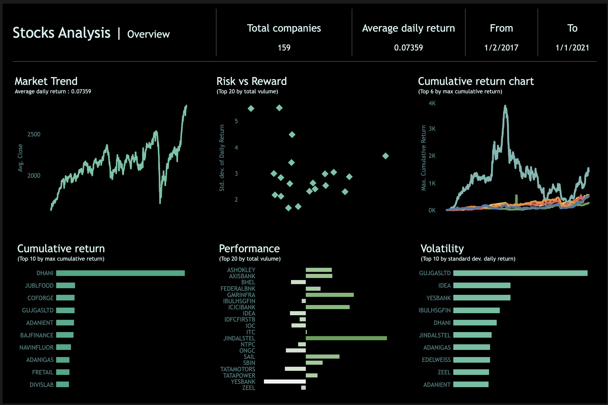
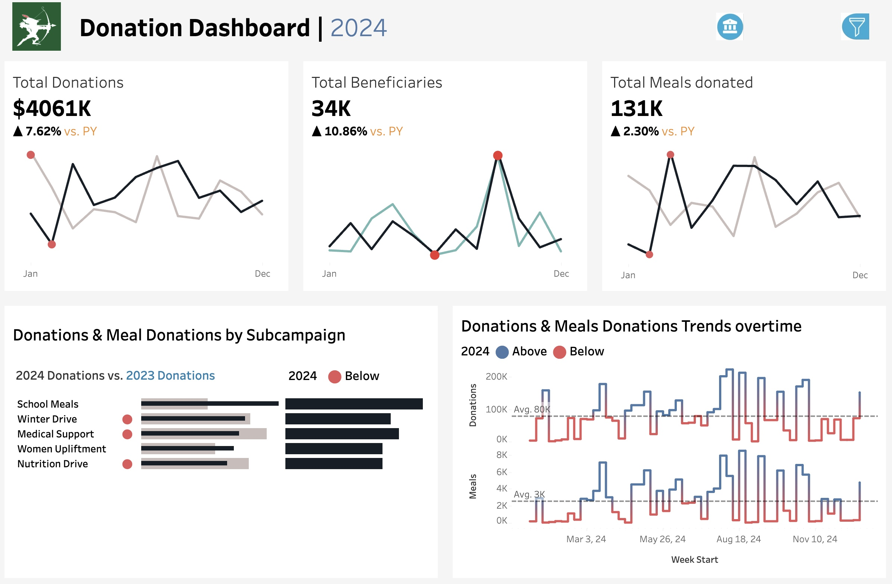
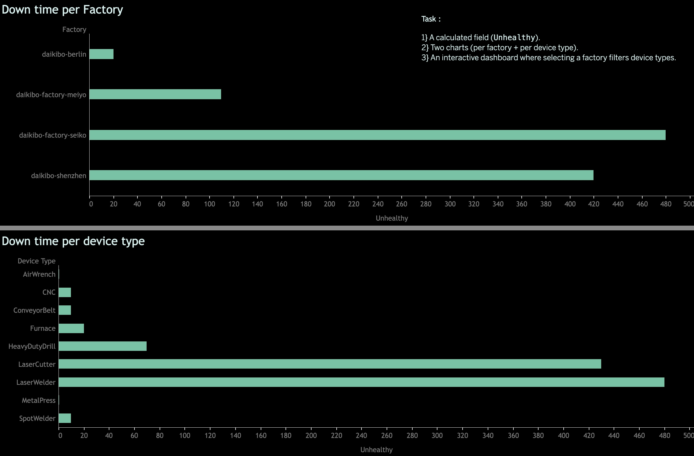

# 📊 Data Analytics Portfolio

Welcome to my *Data Analytics Portfolio*!  
Here you’ll find my featured projects that demonstrate skills in *data cleaning, visualization, and storytelling with data*.  

---

## 🔹 Featured Projects

### 1️⃣ [HR Analytics Dashboard](https://public.tableau.com/views/HRDashboard_17569191985160/HRSummary?:language=en-US&:sid=&:redirect=auth&:display_count=n&:origin=viz_share_link)
•⁠  ⁠Built with *Tableau + SQL*  
•⁠  ⁠Workforce demographics, attrition insights, salary analysis  
•⁠  ⁠Goal: Help HR managers make better people decisions  

---

### 2️⃣ [Stock Market Analysis](https://public.tableau.com/views/Stocksanalysis_17570680419750/Dashboard1?:language=en-US&:sid=&:redirect=auth&:display_count=n&:origin=viz_share_link)
•⁠  ⁠Built with *Python (Pandas, NumPy) + Tableau*  
•⁠  ⁠Analyzed daily returns, volatility, and cumulative returns  
•⁠  ⁠Visualized risk vs reward for 160 companies  
•⁠  ⁠Data collected from NSE India, Kaggle

---

### 3️⃣ [NGO Donation Analysis](https://public.tableau.com/views/DonationDashboardNGO/Donationdashboard?:language=en-US&:sid=&:redirect=auth&:display_count=n&:origin=viz_share_link)
•⁠  ⁠Built with *Tableau + SQL*  
•⁠  ⁠Cleaned and analyzed donation records.  
•⁠  ⁠Dashboard to track donor contributions, trends over time, and impact metrics  

---

### 4️⃣ [Deloitte Task (Dashboard)](https://public.tableau.com/shared/ZG4583RW9?:display_count=n&:origin=viz_share_link)  
•⁠  ⁠Built with *Tableau*  
•⁠  ⁠Created interactive visualizations for factory downtime and device-type analysis  
•⁠  ⁠Implemented calculated fields (e.g., *Unhealthy* measure = 10 mins downtime) to model operational risk  

---

## 🔹 Tech Stack
•⁠  ⁠*Python*: Pandas, NumPy  
•⁠  ⁠*Visualization*: Tableau   
•⁠  ⁠*Databases*: SQL (MySQL)  
•⁠  ⁠*Other*: Excel, Figma, Photoshop

---

## 🔹 About Me
Let’s connect:  
•⁠  ⁠💼 [LinkedIn](www.linkedin.com/in/lalit-singh-827337230)  
•⁠  ⁠📧 Email: lalitkumarsingh4016@gmail.com

---

✨ This portfolio highlights my journey in Data Analytics and my ability to deliver business-focused insights.
